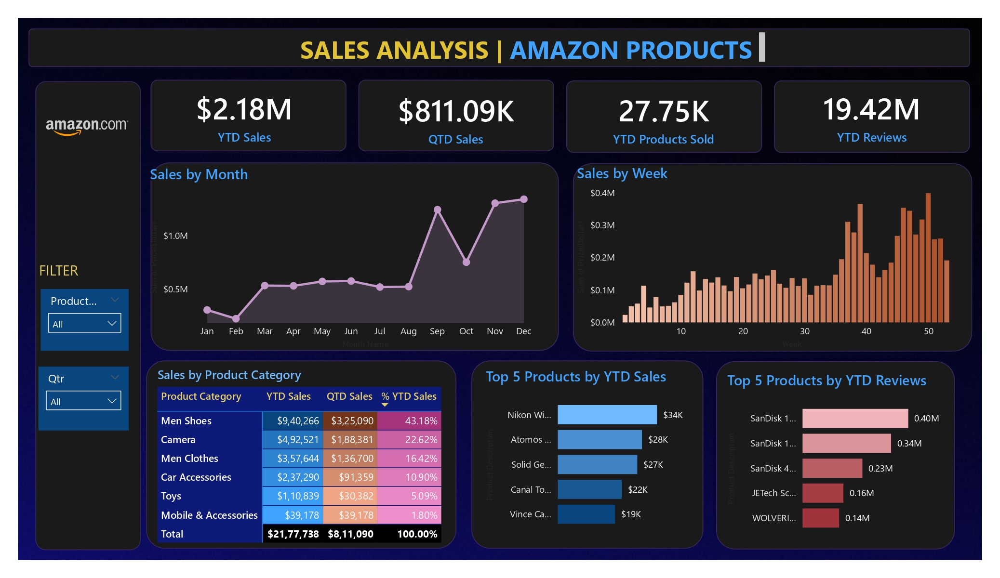

# 📊 Sales Analysis Dashboard (Power BI)

## 📌 Project Overview  
The **Sales Analysis Dashboard** provides an interactive analysis of **Amazon product sales** using **Power BI**.  
It tracks sales performance, customer engagement, and product trends with key KPIs such as **YTD Sales, QTD Sales, Products Sold, and Reviews**.  

This project demonstrates skills in **Power BI data modeling, DAX measures, Power Query transformations, and interactive visualization design**.

---

## 🚀 Features  
- 📈 **KPI Cards**: YTD Sales, QTD Sales, Products Sold, and Reviews.  
- 🗓️ **Sales Trends**: Monthly and weekly sales performance.  
- 🛒 **Product Category Insights**: Breakdown of YTD & QTD sales by category.  
- 🌟 **Top Products**: Best-performing products by YTD sales and reviews.  
- 🎯 **Dynamic Filters**: Product-wise and Quarter-wise drill-downs.  
- 📊 **Interactive Charts**: Line, bar, and stacked visuals for better storytelling.  

---

## 🛠️ Tech Stack / Tools Used  
- **Visualization Tool**: Power BI Desktop  
- **Data Source**: Amazon product sales dataset (CSV/Excel/SQL)  
- **Data Cleaning & Transformation**: Power Query  
- **Data Modeling**: Star schema with fact & dimension tables  
- **DAX Measures**:  
  - `Total Sales = SUM(Sales[SalesAmount])`  
  - `Total Quantity = SUM(Sales[Quantity])`  
  - `Total Reviews = SUM(Sales[Reviews])`  
  - `YTD Sales = TOTALYTD([Total Sales], 'Date'[Date])`  
  - `QTD Sales = TOTALQTD([Total Sales], 'Date'[Date])`  

---

## 📂 Project Structure  
Sales-Analysis-Dashboard/
│
├── Amazon_data.csv        # Cleaned datasets
├── images/                # Screenshots
├── dashboard.pbix         # Power BI / Tableau file             
└── README.md              # Project documentation

===

---

## 📸 Dashboard Preview  
  

---

## 📊 Key Insights  
- 🔹 **Total Sales (YTD)**: $2.18M  
- 🔹 **QTD Sales**: $811K  
- 🔹 **Products Sold (YTD)**: 27.75K  
- 🔹 **Reviews (YTD)**: 19.42M  
- 🔹 **Top Category**: Men Shoes contributed **43.18%** of sales.  
- 🔹 **Top Products by Sales**: Nikon, Atomos, Solid Gear.  
- 🔹 **Top Products by Reviews**: SanDisk products dominated reviews.  

---

